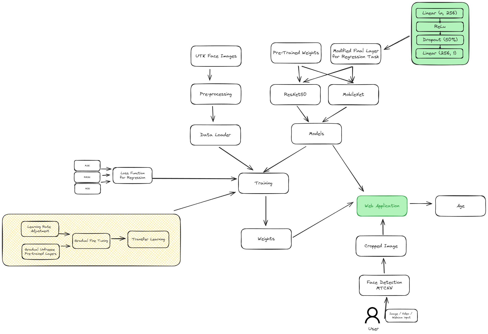

# Face Age Predictor

## Project Overview

This project implements a deep learning model for predicting the age of a person from facial images. It utilises transfer learning with pre-trained ResNet or MobileNet architectures, implemented in PyTorch.

## Features

- Transfer learning using ResNet50 or MobileNet
- Progressive unfreezing for fine-tuning
- Dynamic learning rate adjustment
- Streamlit web application for easy interaction for image, video, and webcam input

## Installation

1 Install the required packages via poetry:

   ```bash
   poetry install
   ```

## Usage

### Training

To train the model, run:

```bash
python scripts/train.py
```

You can adjust hyperparameters in the `configs/config.yaml` file.

#### Trained Weights

The trained weights are saved in this Google Drive [link](https://drive.google.com/file/d/1jFlzMSNgde6-vDtppWr802tR-x6iqY21/view?usp=sharing)

### Prediction

For single image prediction:

```bash
python scripts/predict.py --image_path path/to/your/image.jpg
```

### Web Application

To run the Streamlit web application:

```bash
streamlit run src/app/main.py
```

## Model Architecture

The project uses transfer learning with ResNet50 or MobileNet as the base model, with custom fully connected layers for age regression. The training process includes progressive unfreezing and dynamic learning rate adjustment.



## Theoretical Background (Study Purpose...)

### Model Selection: ResNet vs MobileNet

After few considerations, chose to implement both ResNet and MobileNet architectures for this project, each offering different pros & cons:

1. ResNet:
   - Addresses the vanishing gradient problem in deep networks through skip connections.
   - Allows for very deep architectures (50+ layers) without performance degradation.
   - Provides high accuracy, making it suitable for complex tasks like age prediction.
   - Trade-off: Higher computational requirements and larger model size.

2. MobileNet:
   - Designed for mobile and embedded vision applications.
   - Uses depthwise separable convolutions to reduce model size and computational cost.
   - Offers a good balance between accuracy and efficiency.
   - Ideal for deployment in resource-constrained environments.

### Transfer Learning and Fine-Tuning

Instead of fully training the model, employed transfer learning by utilising pre-trained weights. This approach offers several benefits:

1. Leverages features extracted from pre-trained models, which are useful for a wide range of tasks.
2. Reduces the amount of data needed for training.
3. Speeds up training and often leads to better generalisation.

Transfer Learning / Fine-tuning strategy involves:

1. Progressive Unfreezing:
   - Initially, only the final layers are trainable (Regression layer, as represented below).
        - New layers (Linear -> ReLU -> Dropout -> Linear) allow for non-linear transformations of these features in early layers from pre-trained models.
        - The ReLU activation, in particular, introduces non-linearity, allowing the network to learn more complex relationships.
   - Gradually unfreezing earlier layers allows the model to adapt to age prediction / regression task while preserving early layers' features.
   - This approach is considered as a middle ground between full training and transfer learning.

2. Dynamic Learning Rate Adjustment:
   - As we unfreeze more layers, we reduce the learning rate.
   - This prevents unexpected massive changes to pre-trained weights and allows for finer tweaks.

### Age Prediction as a Regression Task

The age prediction is a regression task rather than a classification task:

1. Regression allows for continuous age predictions, capturing the nuanced nature of age.
2. Avoids arbitrary age group boundaries that classification might impose.
3. The loss function (e.g., MAE, MSE, RMSE) directly relates to the accuracy of age prediction in years.

### Inference Approach

Our inference pipeline includes:

1. Face Detection: Ensures that the model focuses on the relevant part of the image.
2. Image Preprocessing: Standardizes input to match training data distribution.
3. Model Inference: Generates age prediction from the preprocessed face image.
4. Web Application: Provides an easy-to-use interface for users to interact with the model.

### Face Detection

Face detection is an important step in the inference pipeline, as it ensures that the image we submit for inference is properly cropped for face part for age prediction. Given there is a readily available model, the MTCNN for face detection, decided to take an easy route and use it for this project.
